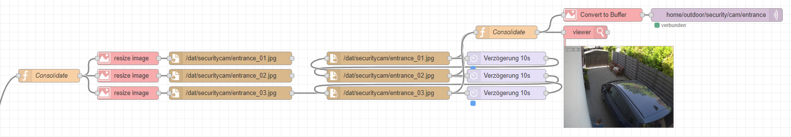

# nodered-securitycam

Retrieval of e-mail, extraction of image attachments, resizing and creation of slideshow for MQTT

If your security cam only sends e-mail attachments, there is the possibility to deal with ONFIV or to process these e-mails further. 

<!-- TOC -->

- [nodered-securitycam](#nodered-securitycam)
    - [FEATURES](#features)
    - [REQUIREMENTS](#requirements)
        - [ADDITIONAL NODES](#additional-nodes)
        - [CONFIGURATION](#configuration)
    - [EXAMPLE](#example)
    - [REMARKS](#remarks)
    - [LICENSE](#license)

<!-- /TOC -->

## FEATURES

- Connect to IMAP server
- Retrieval unread e-mail of security cams from dedicated mailbox
- Mark already processed e-mails as read
- Split by securitycam (only necessary if there are several cams)
- Extract attachments (images) out of e-mail
- Shrink the images to 400px width (configuration in flow variable)
- Write each single image to folder
- Endless loop, which outputs the images in an interval of 10s
- Show output in Node-RED preview
- Send output to MQTT topic

## REQUIREMENTS

### ADDITIONAL NODES

- node-red-node-email
- node-red-contrib-image-tools

### CONFIGURATION

- Configure a dedicated mailbox for the security cams, otherwise you have to separate this emails in your flow
- Make sure the user that runs the Node-RED process has read and write access to the folder for the images

## EXAMPLE

You can find an example in the GitHUB repository: ***flows-nodered-securitycam.json***

## REMARKS

If you decide to use flow- or global variables instead of writing the images to a folder, take care of your heap memory. More information in CHANGELOG.md

## LICENSE

nodered-securitycam and all individual scripts are under the BSD 3-Clause license unless explicitly noted otherwise. Please refer to the LICENSE